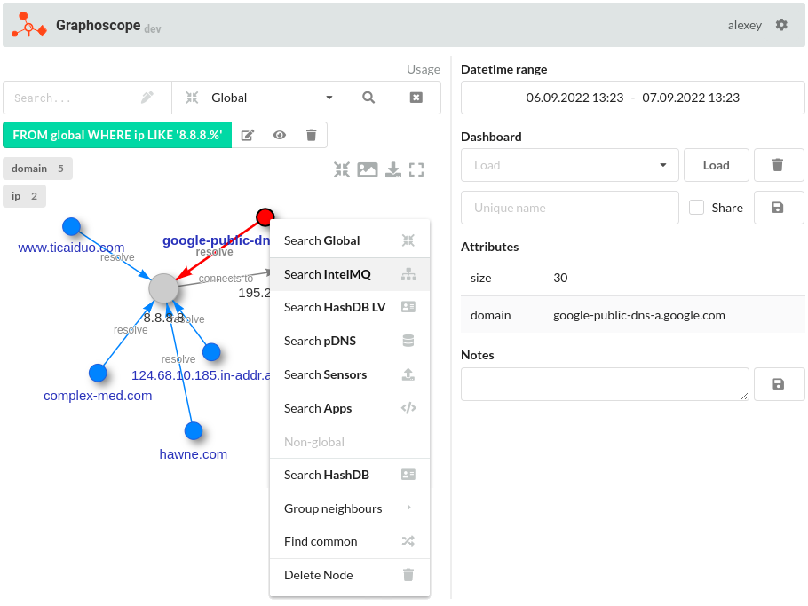

# Graphoscope

An interactive solution to access multiple independent data sources from a common UI and show data relations as a graph:



Contains a list of by default available data sources plugins. 3rd party plugins are also possible. Example workflow if all needed data sources are connected:

1. IP address only is know at the beginning, use it as initial query
2. From Passive DNS find related **domain names**
3. From second data source find **institution** that address belongs to
4. From clients database find institution contact person's **email**
5. From leaked passwords database find where that email was used and secret **passwords**

At the end of `IP address -> Institution -> Contact person's email -> Password` process there could be a possible explanation why something bad has happened to the institution's server.


## Features

- SQL query syntax with features like `BETWEEN`, `IN`, `LIMIT`
- **Usage** examples to skip searching the correct SQL syntax
- Use `... OR ...` or `field IN (...)` queries even if data source doesn't support them
- **Common fields** (like `ip`, `domain`, `timestamp`) that work across all the data sources
- Fields **autocomplete** with a `Tab` key
- Can query both **Web GUI** and **API**
- Every single node & edge type can have its **own style**
- No need to remember all the connected **data source names** - select it from a dropdown
- Search for more **node neighbors**
- **Expand** all selected nodes or just one
- Combine the same **node attributes** from different sources
- **Select multiple nodes** with a mouse right button
- Ability to add **notes** to nodes and edges, visible to everybody
- **Center graph** when it was scrolled/moved far outside of the visible area
- **Delete selected** nodes with `Del`
- **Green inclusion filters**, which work similar to Kibana's filters
- **Red exclusion filters** are applied to all nodes (data source independent)
- Get **node & edge details** by clicking on them
- **Pie-chart statistics** when the amount of requested data exceeds the limit
- **Save & restore** dashboards, private or shared with a team
- **Export/import** all graph visible data
- Display the **amount of visible nodes** grouped by type
- **Group node neighbors** of specific types into the clusters
- **Cache** results for a faster re-query
- **Save canvas** as an image
- **Notification** about new features
- **Format** comma or space separated values into a valid search query
- **Upload indicators list** and wait for the report
- If enabled, query **debug info** is returned to the user to see what happens in a background
- **Background processing** of the data collectors responses for graph enrichment, etc.
- **Personal graph settings**
- **Global graph settings** for administrators
- **User management**
- Built-in **documentation**
- Real-time communication between the browser and server through the **Websockets**


## Architecture


## Documentation

Installation instructions can be found in [INSTALL.md](INSTALL.md) file.

Additional information is available in a Web GUI built-in documentation (also available in [docs/](docs/)):

- UI elements in section `UI`
- Search features in `Search`
- Administration and connecting your own data sources in `Administration`


## Plugins for the data sources

Available plugins are in [plugins/src](plugins/src):

- Elasticsearch
- CSV file
- HTTP API
- MongoDB
- MySQL
- Pastelyzer
- PostgreSQL
- Redis
- SQLite
- AbuseIPDB

3rd party compiled `*.so` plugins should be placed in [plugins/sources](plugins/sources) directory.


## Plugins for the background processing of the data sources response

Available plugins are in [plugins/src](plugins/src):

- Taxonomy
- Modify

3rd party compiled `*.so` plugins should be placed in [plugins/processors](plugins/processors) directory.


## Plugins development

Check a built-in documentation, section `Administration`.


## Usage from Web GUI

With a connected demo data source ([files/demo.csv](files/demo.csv)) select it from a sources dropdown and request all people with an age over **30**:
```sql
age > 30
```
Then extend the graph by searching for more of John's neighbors - right click on `John` and choose `Search Demo` to search for more data in a `Demo` data source. We find that **Jennifer** and **Kate** also are his friends:


Querying the `global` special source retrieves data from all the data sources connected to this namespace concurrently:
```sql
FROM global WHERE age > 30
```

## API usage demo

API can be queried by the external tools, for example with `curl`:
```sh
# SELECT * FROM demo WHERE age > 30
curl -XGET 'https://localhost:443/api?uuid=09e545f2-3986-493c-983a-e39d310f695a&sql=FROM+demo+WHERE+age>30'
# SELECT * FROM global WHERE datetime BETWEEN '2019-01-20T07:27:54+02:00' AND '2019-01-20T07:27:54+02:00'
curl -XGET 'https://localhost:443/api?uuid=09e545f2-3986-493c-983a-e39d310f695a&sql=FROM+global+WHERE+datetime+BETWEEN+%272019-01-20T07:27:54%2B02:00%27+AND+%272019-01-20T07:27:54%2B02:00%27'
# SELECT * FROM intelmq WHERE feed.provider='ShadowServer' AND source.ip='10.10.10.1'
curl -XGET 'https://localhost:443/api?uuid=09e545f2-3986-493c-983a-e39d310f695a&sql=FROM+intelmq+WHERE+feed.provider=%27ShadowServer%27+AND+source.ip=%2710.10.10.1%27'
```

Response example for the first query:
```json
{
    "relations": [
        {
            "from": {
                "id": "Monica",
                "attributes": {
                    "age": 35
                },
                "search": "name",
                "group": "name"
            },
            "edge": {
                "label": "lives in"
            },
            "to": {
                "id": "Canada",
                "search": "country",
                "group": "country"
            },
            "source": "demo"
        },{
            "from": {
                "id": "Chin",
                "search": "name",
                "group": "name"
            },
            "to": {
                "id": "Ben",
                "search": "name",
                "group": "name"
            },
            "source": "demo"
        }
    ]
}
```
... where main fields can be:
- **relations** - list of relations, which consist of:
  * **from**   - describes `From` node of a single relation
  * **to**     - describes `To` node of the same relation
  * **edge**   - describes a single connection between `From` and `To` nodes
  * **source** - data source name
- **stats** - statistics for the processed data when the amount of entries exceeds the limit
- **error** - possible error message


## Fields to use in queries

`sources/*.yaml` data sources definitions allow to create common query fields, like **ip**, **domain**, **datetime**, etc. Other fields come from a related data source.


## TODO & ideas

- [ ] Generate DEB and RPM packages
- [ ] In `graph.js` remove custom zoom limiting
      when https://github.com/visjs/vis-network/pull/629 or similar is merged & new version released
- [ ] Edges groups styling. **TODO** from `search.js`. Implement https://github.com/visjs/vis-network/issues/1229
- [ ] Generate PDF documentation from the existing `*.md` files
- [ ] Generate a direct link to the saved dashboard
- [ ] Data sources access based on user groups permissions
- [ ] Implement other SQL features, like `NOT BETWEEN`
- [ ] Data source plugins:
  - [ ] RTIR
  - [ ] MS SQL
  - [ ] Oracle SQL
  - [ ] Apache Cassandra
  - [ ] Hashlookup
  - [ ] Genji
  - [ ] Presto
  - [ ] MISP
  - [ ] VirusTotal
  - [ ] Shodan
  - [ ] Poland malware Sandbox / mwdb
  - [ ] General TCP
  - [ ] ipinfo.io
  - [ ] phishtank.org
- [ ] Processor plugins:
  - [ ] Filter
- [ ] Output plugins:
  - [ ] RTIR
  - [ ] JIRA
  - [ ] MISP
  - [ ] RITA
  - [ ] REST API


## Useful info

- SQL parsers:<br/>
  https://github.com/blastrain/vitess-sqlparser<br/>
  https://github.com/xwb1989/sqlparser

- Vis-network.js:<br/>
  https://visjs.github.io/vis-network/docs/network/<br/>
  https://visjs.github.io/vis-network/examples/

- Fomantic UI:<br/>
  https://fomantic-ui.com/introduction/getting-started.html

- C3.js:<br/>
  https://c3js.org/reference.html#donut-width<br/>
  https://c3js.org/examples.html

- Authentication<br/>
  https://github.com/gorilla/sessions<br/>
  https://github.com/go-stuff/mongostore<br/>
  https://medium.com/@theShiva5/creating-simple-login-api-using-go-and-mongodb-9b3c1c775d2f

- Markdown renderer<br/>
  https://github.com/markdown-it/markdown-it<br/>
  https://github.com/valeriangalliat/markdown-it-anchor<br/>
  https://github.com/nagaozen/markdown-it-toc-done-right<br/>
  https://github.com/sindresorhus/github-markdown-css<br/>
  https://github.com/markedjs/marked

- Pretty table renderers:<br/>
  https://github.com/olekukonko/tablewriter<br/>
  https://github.com/jedib0t/go-pretty


## License

This project is released under the GNU Affero General Public License v3 or later.

See [LICENSE](./LICENSE) to see the full text.
